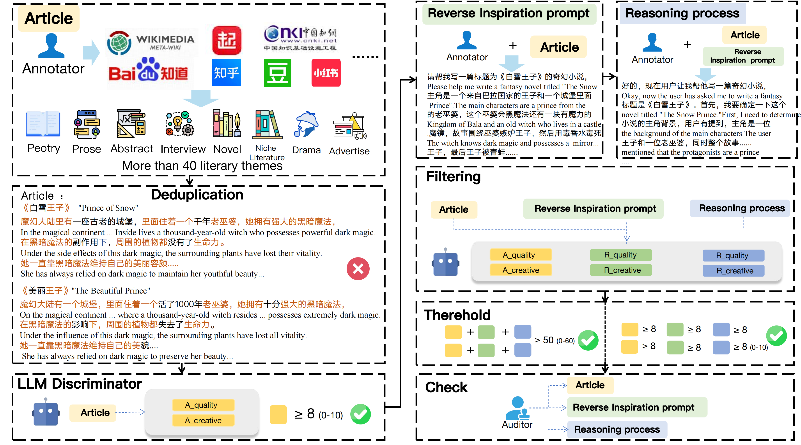

# *COIG-Writer*: A High-Quality Dataset for Chinese Creative Writing with Thought Processes

[🌠Homepage](https://coig-writer.github.io/) · [🤗 Dataset](TODO) · [📖 ArXiv](TODO) · [🙠GitHub](https://github.com/Juno6222222/COIG-Writer)

This repository contains the dataset and supplementary materials for the paper **COIG-Writer: A High-Quality Dataset for Chinese Creative Writing with Thought Processes**.

---

## 🔔 Introduction



**COIG-Writer** is a large-scale Chinese creative writing dataset that links final literary texts with their corresponding reasoning and decision-making processes.  
Each data instance consists of a **reverse-engineered writing prompt**, a **step-by-step reasoning trace**, and the **final text**.  
This structure supports training and evaluation of models on process-level creative generation and narrative reasoning.

The dataset includes **1,665** triplets across **51** genres such as novels, essays, poetry, and scripts.  
It was curated through systematic reverse engineering of high-quality human-authored works, followed by manual validation.  

Key insights:
- Process supervision stabilizes generation when balanced with general data at a **1:12** ratio.  
- Creative ability is **language-specific**, showing limited cross-lingual transfer.  
- Higher lexical diversity (**TTR**) does not necessarily imply better creativity.

---

## 🆠Dataset Statistics

| Metric | Value |
|---|---|
| Total Triplets | 1,665 |
| Total Genres | 51 |
| Prompt Length (min / avg / max) | 30 / 283 / 2,642 |
| Reasoning Length (min / avg / max) | 252 / 1,089 / 4,094 |
| Article Length (min / avg / max) | 12 / 2,214 / 31,071 |

**Genre Distribution**

| Category | Count | Share |
|---|---:|---:|
| Communication Writing | 481 | 28.9% |
| Novel | 467 | 28.0% |
| Non-fiction | 243 | 14.6% |
| Functional Writing | 221 | 13.3% |
| Poetry | 128 | 7.7% |
| Funny Literature | 68 | 4.1% |
| Script | 57 | 3.4% |

---

## âš™ï¸ Installation & Usage

To download and explore the dataset:

```bash
git clone https://github.com/Juno6222222/COIG-Writer.git
cd COIG-Writer
pip install -r requirements.txt
```

You can also load it directly via Hugging Face Datasets:

```python
from datasets import load_dataset
dataset = load_dataset("m-a-p/COIG-Writer")
print(dataset["train"][0])
```

---

## 📜 License

**COIG-Writer** is distributed under the [Open Data Commons Attribution License (ODC-BY)](https://opendatacommons.org/licenses/by/).  
When using this dataset, please provide proper attribution.

---

## 📚 Citation

```bibtex
@misc{coigwriter2025,
  title        = {COIG-Writer: A High-Quality Dataset for Chinese Creative Writing with Thought Processes},
  author       = {Yunwen Li and Shuangshuang Ying and Xingwei Qu and Xin Li and Sheng Jin and Minghao Liu and Zhoufutu Wen and Tianyu Zheng and Xeron Du and Qiguang Chen and Jiajun Shi and Wangchunshu Zhou and Jiazhan Feng and Wanjun Zhong and Chenghua Lin and Eli Zhang},
  year         = {2025},
  eprint       = {TODO},
  archivePrefix= {arXiv},
  primaryClass = {cs.CL},
  url          = {TODO}
}
```
